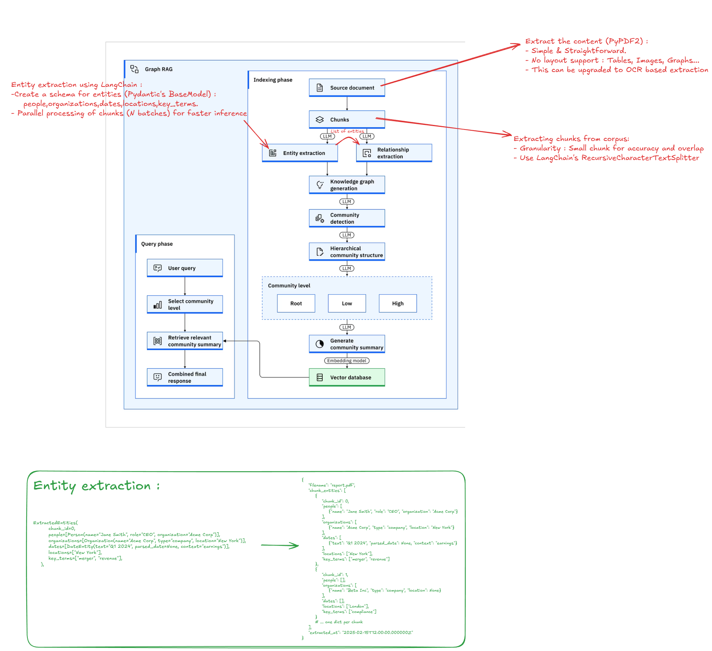
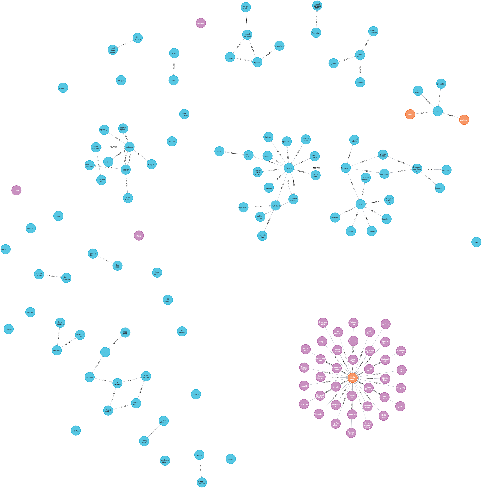

# Ship of Theseus 

Work in progress ...

As I build this project you can have bellow the overview of the features that are already built and supported in the project aswell as some of the system architecture. 

## Graph RAG Architecture (Overview)




The project follows a **Graph RAG** (Graph Retrieval-Augmented Generation) design:

- **Indexing phase:** Source documents are chunked (e.g. with a recursive text splitter), then an LLM extracts entities and relationships to build a knowledge graph. Community detection and a hierarchical structure (Root / Low / High levels) organize the graph; an LLM generates community summaries, which are embedded and stored in a vector database.
- **Query phase:** A user query selects a community level, retrieves relevant community summaries from the vector database, and combines them into a final response.

LLMs drive extraction, community detection, hierarchy building, and summary generation; the vector store holds the community summaries for retrieval.
### Example: Knowledge Graph Visualization



**Legend:**

- **Blue circles** – *Person* entities
- **Green squares** – *Organization* entities
- **Orange diamonds** – *Location* entities
- **Purple hexagons** – *KeyTerm* or *Topic* nodes
- **Arrows** – *Relationship* types (labeled edges) extracted by LLM
- Each graph corresponds to a single document; nodes and relationships are isolated by document filename.

## Features

- 🔐 JWT-based authentication
- 📄 PDF document upload and text extraction
- 🔍 Knowledge graph extraction only: "Process Document" runs entity then relationship extraction; UI shows **Entities & Relationships** (nodes and edges). If graph extraction fails or times out, the user sees "Couldn't extract the knowledge graph" with the specific error reason—no entity-only fallback.
- 🔗 Relationship extraction (auto-triggered after entities); constrained to extracted entities only; graph-ready output (nodes + edges)
- 📦 Redis cache (documents, extraction jobs, relationship jobs); in-memory fallback when Redis is not set
- 🗄️ **Neo4j graph database**: Persist extracted knowledge graphs per document; "Add to Knowledge Base" button in the UI saves the graph to Neo4j; graphs are isolated by document filename
- 🚀 FastAPI backend with modular architecture
- 🎨 Streamlit frontend with component-based design
- 🐳 Docker Compose orchestration (backend, frontend, Redis, Neo4j)
- 📝 Loguru-based logging with automatic rotation and compression
- 📁 Well-organized project structure
- ✅ Ready for testing and extension

## 📁 Project Structure

```
Ship-of-Theseus/
├── backend/
│   ├── app/
│   │   ├── main.py              # FastAPI app initialization
│   │   ├── api/
│   │   │   └── v1/
│   │   │       ├── endpoints/   # API route handlers
│   │   │       │   ├── auth.py
│   │   │       │   ├── documents.py
│   │   │       │   ├── entities.py   # Entity extraction (parallel, progress)
│   │   │       │   └── graph.py     # Neo4j graph persistence (save/list/get/delete)
│   │   │       └── deps.py      # Dependencies
│   │   ├── core/
│   │   │   ├── config.py        # Settings & configuration
│   │   │   ├── cache.py        # Redis cache manager
│   │   │   ├── prompt_manager.py  # LLM prompt loader (JSON, cached)
│   │   │   ├── security.py     # JWT & password utilities
│   │   │   └── logger.py        # Loguru logging configuration
│   │   ├── prompts/             # LLM prompt templates (JSON)
│   │   │   ├── entity_extraction.json
│   │   │   └── relationship_extraction.json
│   │   ├── models/              # Database models (empty - ready for expansion)
│   │   ├── schemas/             # Pydantic schemas
│   │   │   ├── auth.py
│   │   │   ├── entities.py
│   │   │   └── relationships.py
│   │   ├── services/            # Business logic
│   │   │   ├── user_service.py
│   │   │   ├── entity_extraction_service.py
│   │   │   ├── relationship_extraction_service.py
│   │   │   └── neo4j_service.py   # Neo4j graph persistence (save/get/list/delete)
│   │   └── db/                  # Database connection (empty - ready for expansion)
│   ├── requirements.txt
│   └── Dockerfile
├── frontend/
│   ├── app.py                   # Main Streamlit app
│   ├── pages/                   # Multi-page app pages (empty - ready for expansion)
│   ├── components/              # Reusable UI components
│   │   ├── login_form.py
│   │   ├── welcome_page.py
│   │   └── pdf_section.py
│   ├── services/
│   │   └── api_client.py        # API client
│   ├── utils/                   # Helper functions
│   │   ├── auth_utils.py
│   │   └── logger.py            # Loguru logging configuration
│   ├── .streamlit/
│   │   └── config.toml
│   ├── requirements.txt
│   └── Dockerfile
├── shared/                      # Shared utilities (ready for expansion)
├── tests/                       # Test files
│   ├── backend/
│   └── frontend/
├── logs/                        # Application logs (auto-generated)
│   ├── app_YYYY-MM-DD.log      # Backend daily logs
│   ├── errors_YYYY-MM-DD.log   # Backend error logs
│   └── frontend_YYYY-MM-DD.log # Frontend daily logs
├── .env.example                 # Environment variables template
├── .gitignore
├── docker-compose.yml
└── README.md                    # This file
```

## 🚀 Quick Start

### Prerequisites

- Docker and Docker Compose

### Setup

1. **Create `.env` file**:
   ```bash
   # Copy the example file
   cp .env.example .env
   
   # Generate a secure secret key (Linux/Mac)
   SECRET_KEY=$(openssl rand -hex 32)
   
   # Or manually edit .env with your values:
   # - SECRET_KEY: Use a strong random string
   # - USERNAME: Your admin username
   # - USER_EMAIL: Your admin email
   # - USER_PASSWORD: Your secure password
   ```

2. **Start services**:
   ```bash
   docker-compose up -d
   ```

3. **Access the application**:
   - Frontend: http://localhost:8501
   - Backend API: http://localhost:8000
   - Neo4j Browser (optional): http://localhost:7474 (Bolt: localhost:7687)
   - Health check: http://localhost:8000/

## ⚙️ Environment Variables

See `.env.example` (project root) or `backend/.env.example` for backend and Neo4j options.

### Required Variables (app will not start without these):
- `SECRET_KEY` - JWT secret key (generate with `openssl rand -hex 32`) - **REQUIRED**
- `USERNAME` - Admin username - **REQUIRED**
- `USER_EMAIL` - Admin email - **REQUIRED**
- `USER_PASSWORD` - Admin password - **REQUIRED**

### Optional Variables (have defaults):
- `ALLOWED_ORIGINS` - CORS origins (comma-separated, default: `http://localhost:8501`)
- `ACCESS_TOKEN_EXPIRE_MINUTES` - Token expiration in minutes (default: `30`)
- `DEBUG` - Debug mode (default: `False`)
- `REDIS_URL` - Redis connection URL (e.g. `redis://localhost:6379/0`). If unset, in-memory cache is used.
- `OPENAI_API_KEY` - Required for entity extraction; if unset, extraction endpoints return 503.
- `ENTITY_EXTRACTION_MODEL` - LLM model for extraction (default: `gpt-4o-mini`)
- `ENTITY_EXTRACTION_BATCH_SIZE` - Chunks processed in parallel (default: `5`)
- `RELATIONSHIP_EXTRACTION_BATCH_SIZE` - Chunks processed in parallel for relationship extraction (default: `5`)
- `AUTO_EXTRACT_RELATIONSHIPS` - Auto-trigger relationship extraction after entity extraction (default: `true`)
- **Neo4j** (optional; graph persistence disabled if unavailable):
  - `NEO4J_URI` - Bolt URL. **IMPORTANT**: Use `bolt://neo4j:7687` when running in Docker (uses service name), or `bolt://localhost:7687` for local development
  - `NEO4J_USER` - Neo4j username (default: `neo4j`; must match `docker-compose.yml`)
  - `NEO4J_PASSWORD` - Neo4j password (default: `password123`; must match `docker-compose.yml`)
  - `NEO4J_DATABASE` - Database name (default: `neo4j`)

## 🏃 Running Locally (Development)

### Backend
```bash
cd backend
pip install -r requirements.txt
uvicorn app.main:app --reload --port 8000
```

Logs will be automatically created in the `logs/` directory with automatic rotation and compression.

### Frontend
```bash
cd frontend
pip install -r requirements.txt
streamlit run app.py
```

Logs will be automatically created in the `logs/` directory with automatic rotation and compression.

## 🧪 Testing

```bash
# Backend tests
cd backend
pytest

# Frontend tests
cd frontend
pytest

# Run with coverage
pytest --cov=app --cov-report=html
```

## 📡 API Endpoints

### Base URL
`http://localhost:8000/api`

### Authentication Endpoints
- `POST /auth/login` - Login and get JWT token
- `GET /auth/me` - Get current user info (requires auth)
- `GET /auth/verify` - Verify token validity (requires auth)

### Document Management Endpoints
- `POST /documents/upload` - Upload PDF and extract text (requires auth, max 10MB); stored in Redis
- `GET /documents/current` - Get currently stored document (requires auth)
- `DELETE /documents/current` - Clear stored document (requires auth)

### Entity Extraction Endpoints (parallel, progress via Redis)
- `POST /entities/extract` - Start entity extraction on current document; returns `job_id` (requires auth). When complete, relationship extraction is auto-started with job_id `{job_id}_rel`.
- `GET /entities/extract/status/{job_id}` - Get extraction progress: status, `completed_chunks`/`total_chunks` (requires auth)
- `GET /entities/extract/result/{job_id}` - Get extraction result when completed (requires auth; 202 if still running)

### Relationship Extraction Endpoints (graph-ready: nodes + edges)
- `GET /entities/extract/relationships/status/{job_id}` - Get relationship extraction progress (use `{entity_job_id}_rel` as job_id) (requires auth)
- `GET /entities/extract/relationships/result/{job_id}` - Get graph result (nodes + edges) when relationship extraction completed (requires auth; 202 if still running)
- `GET /entities/extract/graph/{job_id}` - Get complete graph for an entity job (uses entity job_id; returns graph when relationship extraction has completed) (requires auth)

### Graph Persistence (Neo4j) Endpoints
- `POST /graph/save/{job_id}` - Save extracted graph to Neo4j (uses entity job_id; requires auth)
- `GET /graph/list` - List documents in Neo4j with node/edge counts (requires auth)
- `GET /graph/{document_name}` - Get graph from Neo4j by document name (requires auth)
- `DELETE /graph/{document_name}` - Delete document graph from Neo4j (requires auth)
- `GET /graph/health` - Neo4j connectivity check (requires auth)

## 🐳 Docker, Redis, and Neo4j

With Docker Compose, the backend uses **Redis** for caching and **Neo4j** for persistent graph storage:
- **Documents**: Stored under `documents:{user_id}` (TTL 24h)
- **Extraction jobs**: Status and result under `extraction:job:{job_id}` (TTL 1h)
- **Relationship jobs**: Status and graph result under `extraction:relationships:job:{job_id}` (TTL 1h)

- **Redis** runs as service `redis`; the backend gets `REDIS_URL=redis://redis:6379/0` when using Docker. For local runs, set `REDIS_URL` (e.g. `redis://localhost:6379/0`) or leave unset to use in-memory cache.
- **Neo4j** runs as service `neo4j` with persistent volume `neo4j_data`. **IMPORTANT**: Set `NEO4J_URI=bolt://neo4j:7687` in `.env` when using Docker (not `localhost`). The authentication credentials (`NEO4J_USER` and `NEO4J_PASSWORD`) must match those in `docker-compose.yml` (default: `neo4j/password123`). Each document's graph is stored separately (isolated by document filename). Use the "Add to Knowledge Base" button in the PDF section to save the extracted graph to Neo4j.

## 🐳 Docker Commands

```bash
# View logs
docker-compose logs -f [service_name]

# Rebuild service
docker-compose build [service_name]
docker-compose up -d [service_name]

# Stop all services
docker-compose down

# Stop and remove volumes
docker-compose down -v
```

## 📚 Documentation

- [DEVELOPMENT.md](DEVELOPMENT.md) - Development log and changelog
- [.cursor/rules/README.mdc](.cursor/rules/README.mdc) - Complete project documentation and standards
- [.cursor/rules/cursorrules.mdc](.cursor/rules/cursorrules.mdc) - Cursor AI assistant rules
- [.cursor/rules/context.mdc](.cursor/rules/context.mdc) - Project context for AI assistant
- [.cursor/rules/DEVELOPMENT.mdc](.cursor/rules/DEVELOPMENT.mdc) - Development guidelines
- [tests/README.md](tests/README.md) - Testing guide
- [shared/README.md](shared/README.md) - Shared utilities guide

## 🔧 Development

The project follows a modular architecture:

- **Backend**: FastAPI with clean separation of concerns (routes, services, schemas, core)
- **Frontend**: Streamlit with component-based design
- **Shared**: Common utilities that can be used by both services
- **Tests**: Comprehensive test coverage for both services
- **Logging**: Loguru-based logging with automatic rotation, compression, and colored console output

### Logging

This project uses [Loguru](https://github.com/Delgan/loguru) for all logging needs.

**Backend logging:**
```python
from app.core.logger import logger

logger.info("General information")
logger.success("Operation succeeded")
logger.warning("Warning message")
logger.error("Error message")
logger.exception("Exception with traceback")
```

**Frontend logging:**
```python
from utils.logger import logger

logger.info("User action")
logger.success("Operation completed")
```

**Features:**
- Automatic file rotation at midnight
- Log retention: 30 days (general), 90 days (errors)
- Automatic compression of old logs
- Colored console output for better readability
- Thread-safe logging
- Separate log files for backend and frontend
- Debug level logging in files, INFO level in console

See [.cursor/rules/README.mdc](.cursor/rules/README.mdc) for detailed development guidelines and project standards.

### Prompt Management

LLM prompts for entity and relationship extraction are stored as JSON files in `backend/app/prompts/`. The **PromptManager** (`app.core.prompt_manager`) loads and caches these prompts so you can edit prompt text without changing Python code.

- **Location**: `backend/app/prompts/*.json`
- **Format**: Each file has `name`, `description`, `version`, `template`, `input_variables`, and optional `metadata`.
- **Usage**: Services call `PromptManager.get_prompt("entity_extraction")` or `PromptManager.get_prompt("relationship_extraction")` to get the template and input variables.
- **Customization**: Edit the JSON files to change prompt wording; the app uses cached copies until restarted (or call `PromptManager.reload_prompt(name)` / `PromptManager.clear_cache()` to refresh).

## License

MIT
